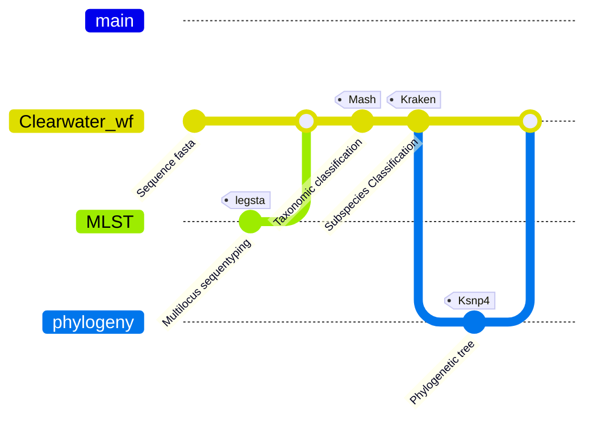

# Clearwater
A web-deployed pipeline to analyze Legionella pneumophila samples.

# Workflow



# Software Tools implemented/Dependencies
kraken, elgato, ksnp4, legsta, mash.

# Installation
### Clone repository
```
git clone https://github.com/BPHL-Molecular/clearwater.git
```

### Create your conda environment
Use the provided CWenvironment.yml file to execute the command below, and a conda environment named CLEARWATER will be created.
```
conda env create -f CWenvironment.yml
```

# Usage
Clearwater takes as input raw assembly sequence file in FASTA format. Additionally, you feed the pipeline with the path to costumed Kraken subspecies database and the value of the k (k = 17 by default) parameter.<br />
Then you write all input in the params.yaml file.<br />
Activate the created conda environment <br />
```
conda activate CLEARWATER
```
The basic command to run Clearmater is set below. <br />
```
nextflow run clearwater_wf.nf -params-file params.yaml -resume
```