# [Clearwater]

A scalable, automated **Nextflow DSL2 pipeline** for genomic characterization, quality control, phylogenetic mapping, and machine learning-driven subtyping of ***Legionella pneumophila*** assemblies.

## 📖 What Clearwater Does

This pipeline provides a unified "sequence-to-insight" workflow for raw bacterial FASTA assemblies. It processes strains simultaneously through a hybrid architecture of linear analytical steps and asynchronous multi-sample cohort steps:

* **In Silico Serotyping & Subtyping:** Leverages `ELGATO` and `Legsta` for automated sequence typing (MLST).
* **Taxonomic Assignment:** Uses `Kraken2` for deep subspecies-level identification.
* **Assembly Quality Control:** Runs asynchronous `CheckM` evaluations to assess completeness and contamination.
* **Core & Pan-Genomic Phylogeny:** 
  * Identifies reference-free core SNPs and builds bootstrapped trees using `kSNP4` and `IQ-TREE`.
  * Generates structural annotations (`Prokka`) and executes gene-family clustering (`Roary`) to map the pangenome matrix.
* **Comparative Genomics:** Calculates Average Nucleotide Identity (`FastANI`) against reference libraries.
* **Predictive Analytics & Advanced Modeling:** 
  * Imputes missing loci elements (`miceforest`) and trains a **K-Nearest Neighbors (KNN)** classifier to resolve *L. pneumophila* subspecies.
  * Conducts **Principal Component Analysis (PCA)** post-classification to visualize high-dimensional feature distributions and variance.
  * Subjects downstream profiles to data-driven **Firth Logistic Regression** alongside a terminal **Lasso Multinomial Logistic Regression** model for feature pruning and classification.

---
## 📊 Pipeline Workflow Diagram
This chart outlines how independent single-sample data streams run alongside asynchronous, multi-sample cohort configurations:

```mermaid
graph TD
    %% Configuration and Styling
    classDef params fill:#f9f,stroke:#333,stroke-width:2px;
    classDef process fill:#bbf,stroke:#333,stroke-width:1px;
    classDef channel fill:#dfd,stroke:#333,stroke-width:1px;
    classDef collection fill:#ffd27f,stroke:#333,stroke-width:1px;

    %% Input Configurations / Parameters
    subgraph Input_Parameters [Pipeline Inputs]
        P1[params.input] -->|*.fasta| ch_samples(ch_samples channel)
        P2[params.ref_genomes_dir] --> ch_ref_dir(ch_ref_dir Value Channel)
        P3[params.krakenSub_db] --> kraken_db_file[krakenSub_db File]
    end

    %% Parallel Sample Processing Stream (Linear Chain)
    subgraph Sample_Stream [Per-Sample Parallel Processing Line]
        ch_samples --> elgato4mlst[elgato4mlst]
        elgato4mlst --> legsta[legsta]
        legsta -->|ch_legsta_out| kraken_subs[kraken_subs]
        kraken_db_file --> kraken_subs
        
        kraken_subs -->|ch_kraken_out| proc_mash[proc_mash]
        proc_mash --> pyProc1[pyProc1]
        pyProc1 --> prokka[prokka]
    end

    %% Asynchronous Batch / Collection Parallel Pathways
    subgraph Core_SNP_Phylogeny [Core Genome Assembly Branch]
        ch_samples -->|collect| ch_collected_fastas(Collected FASTAs)
        ch_collected_fastas --> ksnp4[ksnp4]
        ksnp4 -->|run_dir| iqtree_bootstrap[iqtree_bootstrap]
    end

    subgraph Assembly_QC [Asynchronous Quality Control]
        ch_collected_fastas --> checkm_qc[checkm_qc]
    end

    %% Gene Pangenome with Plotting Functionality
    subgraph Gene_Pangenome [Pangenome Extraction & Plotting Branch]
        prokka -->|ch_prokka_out| map_gff{Isolate GFF Files}
        map_gff -->|collect| ch_collected_gffs(Collected GFFs Array)
        ch_collected_gffs --> PANGENOME_ANALYSIS[PANGENOME_ANALYSIS]
        PANGENOME_ANALYSIS -->|run_dir| PLOT_PANGENOME[PLOT_PANGENOME]
    end

    %% Linear Chain Post-Prokka
    subgraph Individual_Annotation_and_ANI [ANI Verification Loop]
        prokka -->|ch_prokka_out| pyProc4[pyProc4]
        pyProc4 --> pyProc5[pyProc5]
        
        %% Combined Logic
        pyProc5 -->|ch_processed_samples| combine_checkm{combine}
        checkm_qc -->|results_dir| combine_checkm
        
        combine_checkm -->|ch_with_checkm| pyProc3[pyProc3]
        pyProc3 -->|ch_ani_inputs| runFastANI[runFastANI]
        ch_ref_dir --> runFastANI
    end

    %% Consolidation and Statistical Analytics Node
    subgraph Final_Reporting_Analytics [Reporting & Downstream Analytics]
        runFastANI -->|ch_ani_outputs| pyProc6[pyProc6]
        pyProc6 --> pyProc7[pyProc7]
        
        pyProc7 -->|ch_global_report| map_report{Map report.txt}
        map_report -->|collect| all_reports_ch(All Sample Reports Array)
        
        all_reports_ch --> compile_report[compile_report]
        compile_report -->|global_report| data_preprop[data_preprop]
        data_preprop -->|imputed_report| knn_classifier[knn_classifier]
        
        %% NEW STEPS ADDED HERE
        knn_classifier -->|knn_results| pca_analysis[pca_analysis]
        pca_analysis --> firth_regression[firth_regression]
        firth_regression --> SKLEARN_LASSO[SKLEARN_LASSO]
    end

    %% Assigning Classes for Visual Identification
    class P1,P2,P3 params;
    class elgato4mlst,legsta,kraken_subs,proc_mash,pyProc1,prokka,pyProc4,pyProc5,ksnp4,iqtree_bootstrap,checkm_qc,PANGENOME_ANALYSIS,PLOT_PANGENOME,pyProc3,runFastANI,pyProc6,pyProc7,compile_report,data_preprop,knn_classifier,pca_analysis,firth_regression,SKLEARN_LASSO process;
    class ch_samples,ch_ref_dir,ch_collected_fastas,ch_collected_gffs,all_reports_ch channel;
    class combine_checkm,map_gff,map_report collection;
```


---

## 🛠 Dependencies

The pipeline relies on a containerized or environment-managed runtime strategy to maximize reproducibility. You do not need to install the individual bioinformatics utilities manually.

### Core Frameworks
* **Nextflow** (Runtime tool; Java-based engine)

### Container Registries (Docker / Singularity)
The pipeline automatically fetches and launches isolated tool tasks using the following community layers:
* `staphb/prokka:latest` — Structural genome annotations
* `staphb/roary:latest` — High-performance pangenome calculation & graphing scripts
* `staphb/ksnp4:latest` — Core k-mer SNP phylogenetics and file layout parsing
* `staphb/kraken2:latest` — High-speed database string matching

### Conda Profiles (Local Fallbacks)
Statistical and machine learning scripts drop down to local environment recipes utilizing:
* `pandas` & `numpy` (Structured data parsing matrices)
* `scikit-learn` (KNN Classification engines, PCA dimensionality reduction, and Lasso Multinomial Logistic Regression modeling)
* `miceforest` (Iterative Chained Equations imputation)
* `matplotlib` & `seaborn` (Statistical matrix plotters & scatter/heatmap visualization engines)

---

## 💻 Resources Required

Requirements scale dynamically depending on your cohort batch sizing. Minimum allocations for the **10-sample testing baseline** include:

| Component | Minimum Specification | Recommended Specification | Notes |
| :--- | :--- | :--- | :--- |
| **CPU Threads** | 4 Cores | 8–16 Cores | `Roary (MAFFT)` and `kSNP4` scale linearly with core counts |
| **RAM** | 16 GB | 32 GB+ | Large `Kraken2` databases require memory headroom |
| **Storage** | 20 GB free space | 100 GB+ SSD | Accounting for database structures and intermediate caches |
| **OS** | Linux / macOS | Linux (Ubuntu/CentOS) | Essential for native Docker/Singularity daemon linking |

---

## 🚀 How to Run It (Usage)

### 1. Configure Parameters
Set up your file paths and parameters inside a local execution config or declare them inline during runtime execution.

### 2. Automatically create the pipeline conda environment to upload all conda packages
#### a) Execute this command on your terminal
```bash
conda env create -f CLEARWATERenvironment.yml
```
#### b) Activate de created environment
```bash
conda activate CLEARWATER
```
### 3. Standard Execution Command
Launch the master execution run by pointing to your local directory architecture or use the provided sbatch script(clearwater_run.sh):

```bash
nextflow run main.nf \
  --input "/path/to/your/fasta_folder" \
  --ref_genomes_dir "/path/to/reference_library" \
  --krakenSub_db "/path/to/kraken_database_file" \
  --output "results_output" \
  -profile docker
```

*To resume an interrupted or cached pipeline run without reprocessing completed steps, add the `-resume` flag.*

---

## 📂 Example of Output

When execution finishes, the designated output directory (`params.output/`) will be populated with structured computational folders:

```text
results_output/
├── [SampleID]/                     # Individual sample analytics folders
│   └── prokka_out/                 # GFF, FAA, FNA, and GBK file maps
├── pangenome_analysis/
│   └── roary_out/
│       ├── gene_presence_absence.csv  # Global pangenome matrix spreadsheet
│       ├── summary_statistics.txt     # Breakdown of Core, Shell, and Cloud distributions
│       └── core_gene_alignment.aln    # MAFFT core gene sequence alignment file
├── lassoMregression_results/
│   ├── lasso_model_summary.txt              # Model feature selection stats
│   ├── lasso_coefficients_reportingTable.csv # Feature performance scores
│   └── lasso_coefficients_heatmap.png       # Multiclass predictive heatmap
```
